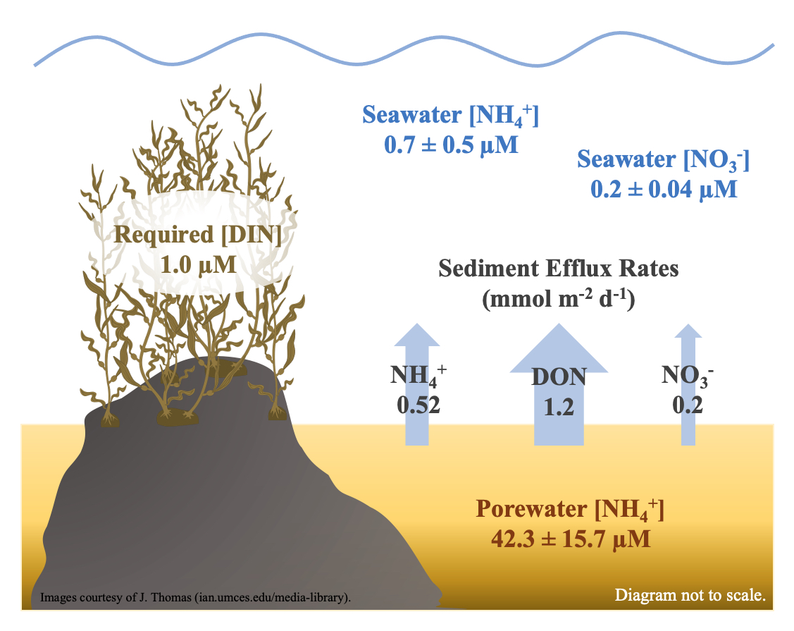

# sediment-nuts-2021
Repository containing data and scripts for the following manuscript:

*Lowman, H.E., M.E. Hirsch, M.A. Brzezinski, J.M. Melack. Examining the Potential of Sandy Marine Sediments Surrounding Giant Kelp Forests to Provide Recycled Nutrients for Growth. Journal of Coastal Research. https://doi.org/10.2112/JCOASTRES-D-22-0035.1*

All data can be downloaded from the [Santa Barbara Coastal Long Term Ecological Research Program's data portal](https://sbclter.msi.ucsb.edu/data/catalog/package/?package=knb-lter-sbc.151).

For additional support or information regarding this project, please contact Heili at hlowman *at* unr.edu.

